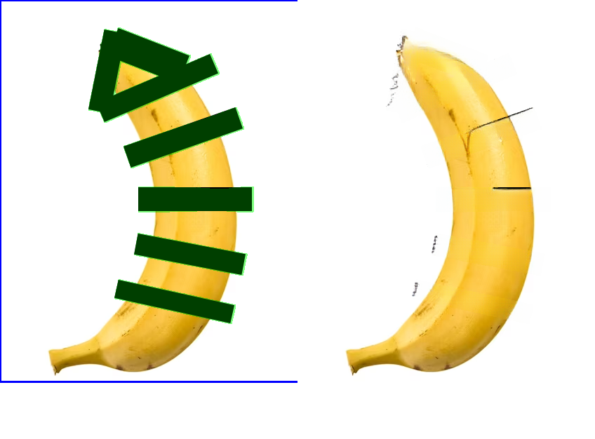

# Er0manga censorship inpainting

This repo contains training and testing code for the manga censorship inpainting and is based on LaMa.

## Quick start:

### Step 0: Install anaconda3/miniconda3 and create the environment:

You can skip this step if you already have the environment from [Er0mangaSeg](https://github.com/Er0manga/Er0mangaSeg/). Both Segmentation and Inpainting repo use the same environment. If you don't have the environment, follow the instruction from Step 0 in [Er0mangaSeg](https://github.com/Er0manga/Er0mangaSeg/).

### Step 1: Download the pretrained model:

Download pretrained LaMa model from `https://mega.nz/file/gRYn2CBJ#HZ73lqn5noX_t2eyfIaDk7sIDfnGQ9gBwClJ6O3VdTE` and put it into the `pretrained` directory. This model is finetuned by the author on uncensored manga dataset, so it performes better on screentoned images.

### Step 2: Run the demo:

Run the model on the demo image located in `demo_images`:

 

```
PYTHONPATH=$PWD TORCH_HOME=$PWD python bin/uncen.py --in_dir=./demo_images/demo_input/ --mask_dir=./demo_images/demo_mask/ --out_dir=./output --debug_dir=./output_dbg --checkpoint=./pretrained/00-30-09
```

The result will be located in `./output` and the debug output will be located in `./output_dbg`.

The debug output should look like this:



## Usage:

### Test the model:

`PYTHONPATH=$PWD TORCH_HOME=$PWD python bin/uncen.py --in_dir=<input dir with png images> --mask_dir=<dir with corresponding inpainting masks> --out_dir=<output directory> --debug_dir=<optional debug output directory> --checkpoint=<directory with checkpoint, must contain models/best.ckpt and config.yaml>`

### Train the model:

Modify `configs/training/hconfig.yaml` to match you configuration (dataset location, gpus used, batch size, checkpoint, etc...) and run:

`PYTHONPATH=$PWD TORCH_HOME=$PWD python3 bin/train.py -cn hconfig`

## Dataset format:

Same as in [Er0mangaSeg](https://github.com/Er0manga/Er0mangaSeg/).

TODO: add dataset collection scripts
